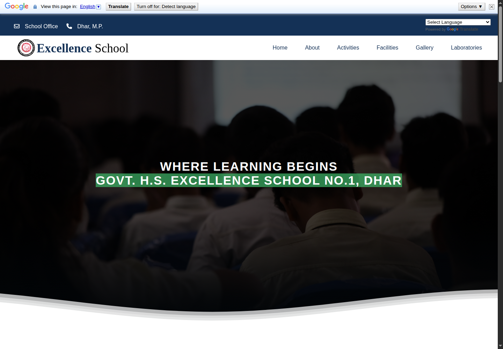
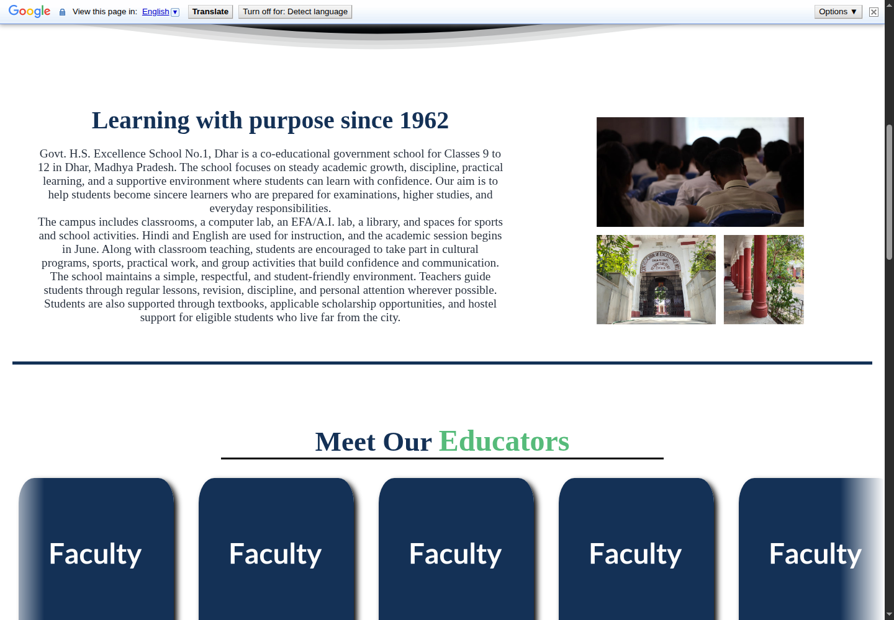
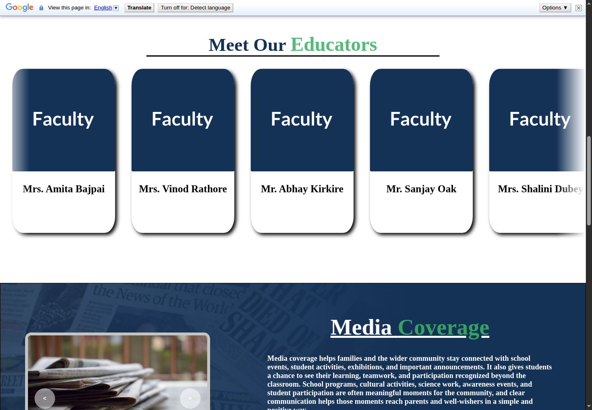
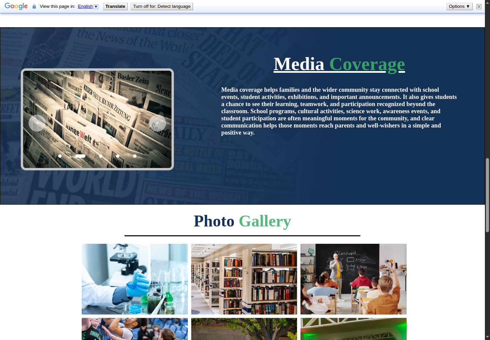
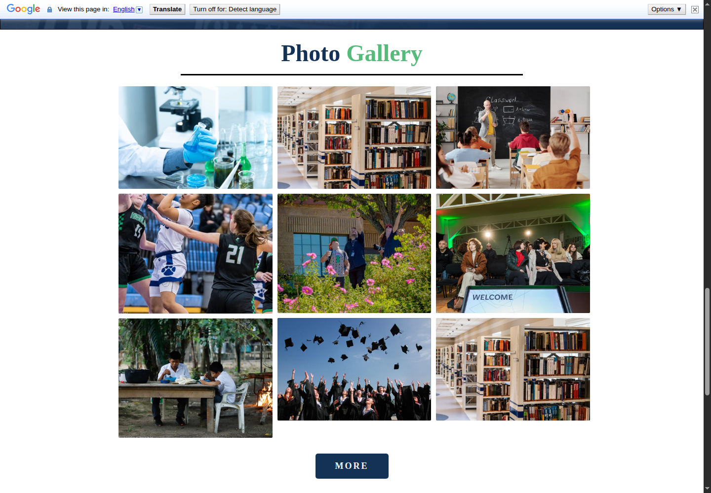
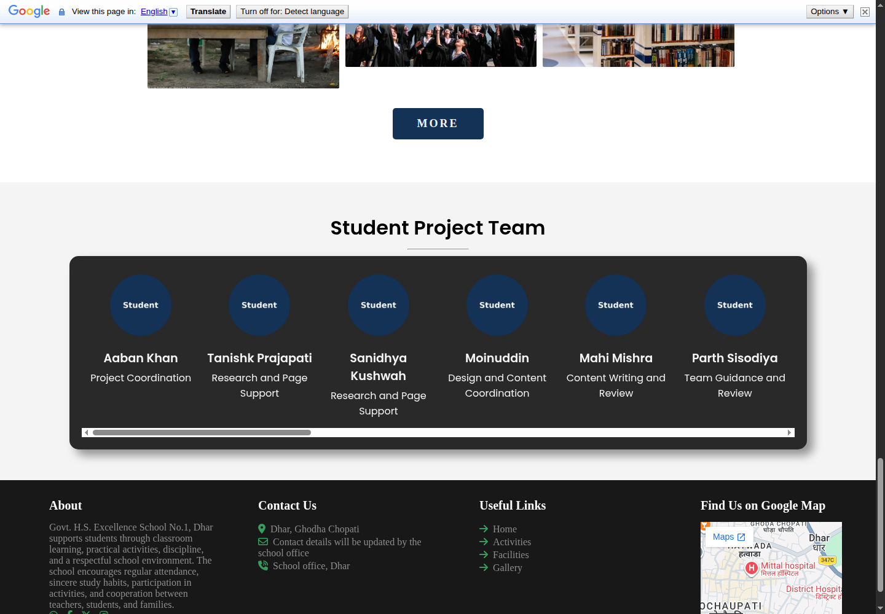
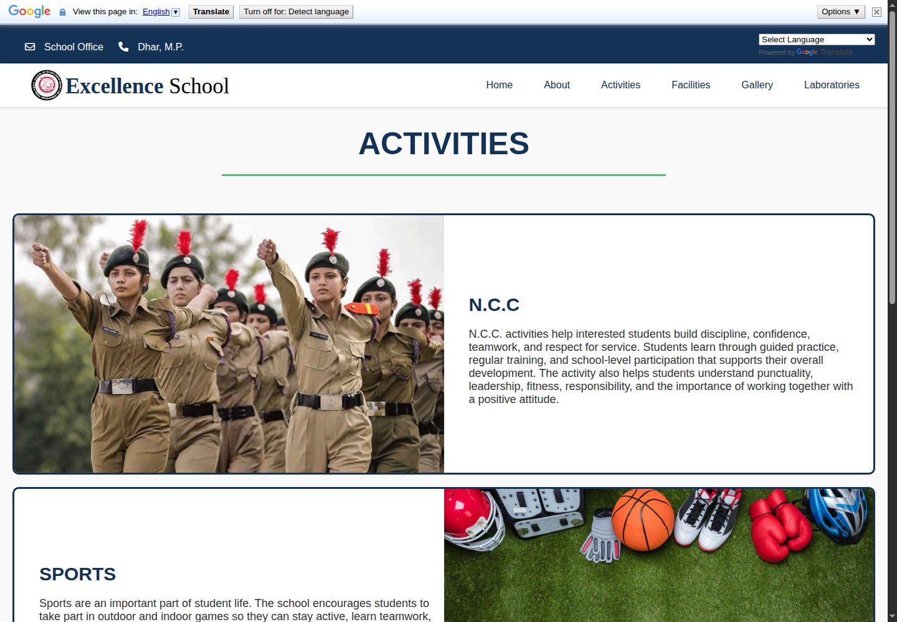
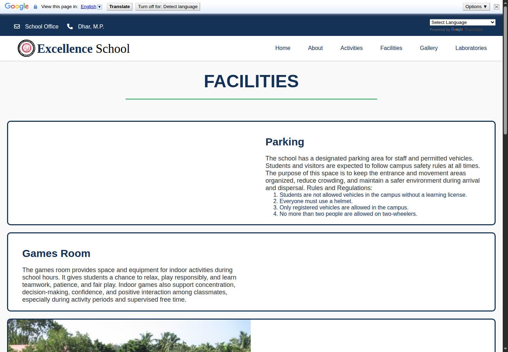
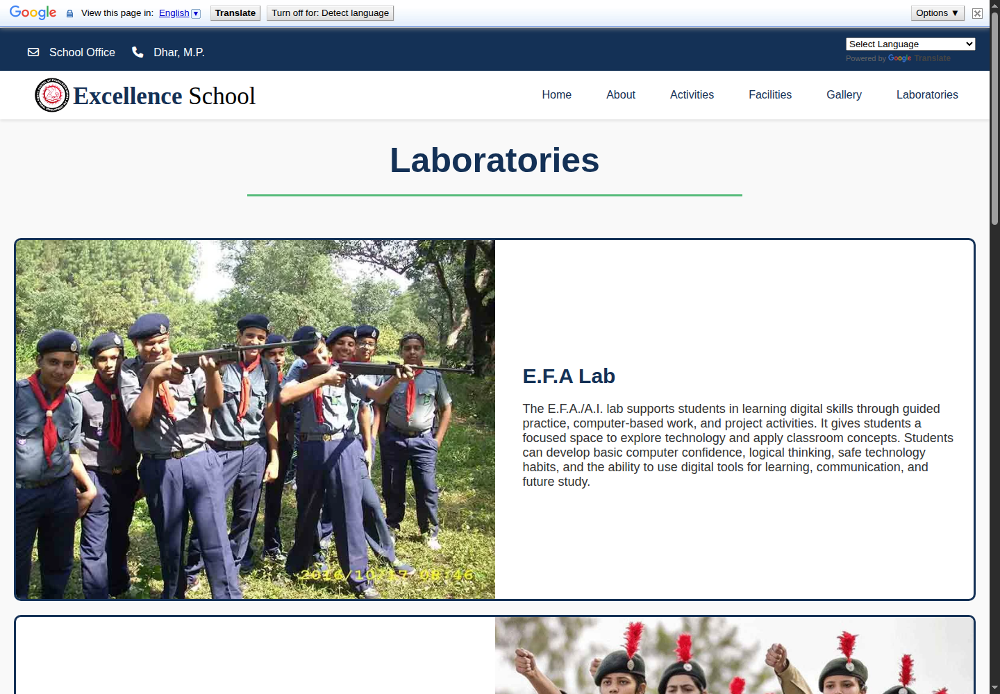
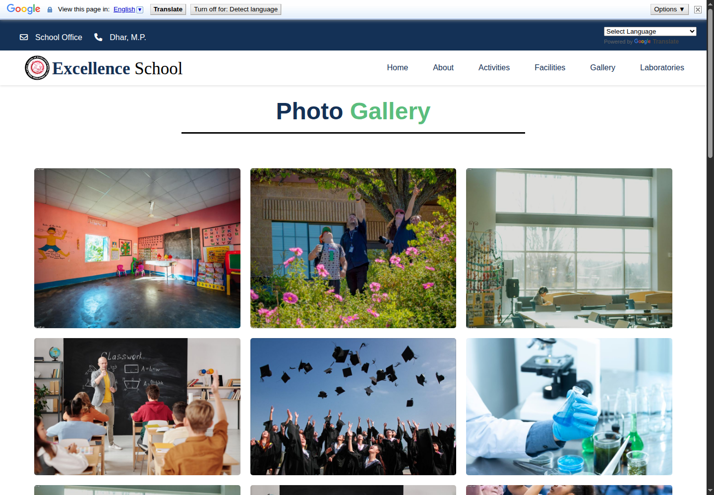

# Excellence School Workshop Website

A static school website built during my Class 10 workshop project for **Govt. H.S. Excellence School No.1, Dhar**.

I worked on this project as the **Project Manager**, where I helped coordinate the team, organize the website sections, manage content flow, and bring the final workshop website together.

This project is special because it was created at an early stage of my web-development journey. It represents student teamwork, learning by building, and the effort to create a complete school website from scratch.

## About The Project

The website presents important school information in a simple and organized way. It includes pages for the school introduction, educators, media coverage, gallery, activities, facilities, laboratories, and project team.

The goal was to build a clean, informative, and easy-to-use school website as part of a workshop project.

## My Role

**Role:** Project Manager

As project manager, I worked on:

- Planning the website sections
- Coordinating with the student team
- Managing content and page flow
- Reviewing the final website structure
- Helping keep the project organized and presentation-ready

## Features

- Responsive school homepage
- About section
- Educator cards
- Media coverage section
- Photo gallery
- Activities page
- Facilities page
- Laboratories page
- Student project team section
- Dropdown navigation
- Image slider
- Scroll animations
- Google Translate widget
- Google Maps embed

## Screenshots

### Home

The landing section introduces the school with a bold visual opening and navigation.

### About

The About section explains the school background, learning environment, and student support.

### Educators

The Educators section presents faculty names in a clean horizontal card layout.

### Media Coverage

The Media Coverage section uses newspaper-style visuals and explains how school activities connect with the wider community.

### Photo Gallery

The gallery section shows school-life images, learning spaces, and activity visuals.

### Student Project Team

The Student Project Team section gives credit to the students who contributed to the workshop website.

### Activities

The Activities page covers N.C.C., sports, and Scouts and Guides.

### Facilities

The Facilities page highlights spaces like parking, games room, playground, dance, music, and library.

### Laboratories

The Laboratories page explains practical learning spaces such as E.F.A./A.I., security, biology, physics, and chemistry labs.

### Full Gallery

The full gallery page displays a larger collection of school-related visuals.

## Tech Stack

- HTML
- CSS
- JavaScript
- Font Awesome
- Google Translate
- Google Maps Embed

## Pages

| File | Description |
| --- | --- |
| `EXCELLENCE.HTML` | Main homepage |
| `ACTIVITES.HTML` | Activities page |
| `facilities.html` | Facilities page |
| `lab.html` | Laboratories page |
| `SCHOOL-GALLERY.HTML` | Photo gallery page |
| `translate.html` | Language support page |

## How To Run

This is a static website, so no installation is required.

1. Clone or download the repository.
2. Open `EXCELLENCE.HTML` in your browser.
3. Use the navigation menu to explore the pages.

## Privacy Note

The public version uses neutral placeholder images for educators and student project-team members. This keeps the website suitable for public deployment while preserving the original layout and workshop credit section.

## Repository Check

I checked the repository for common private data leaks such as API keys, tokens, passwords, `.env` files, databases, and secret files. No obvious secrets were found.

Things to be aware of:

- Git commit metadata shows the GitHub author email.
- Student names are visible in the project team section.
- The school location text is visible in the footer.

If any of those should not be public, they should be removed or replaced before final deployment.
